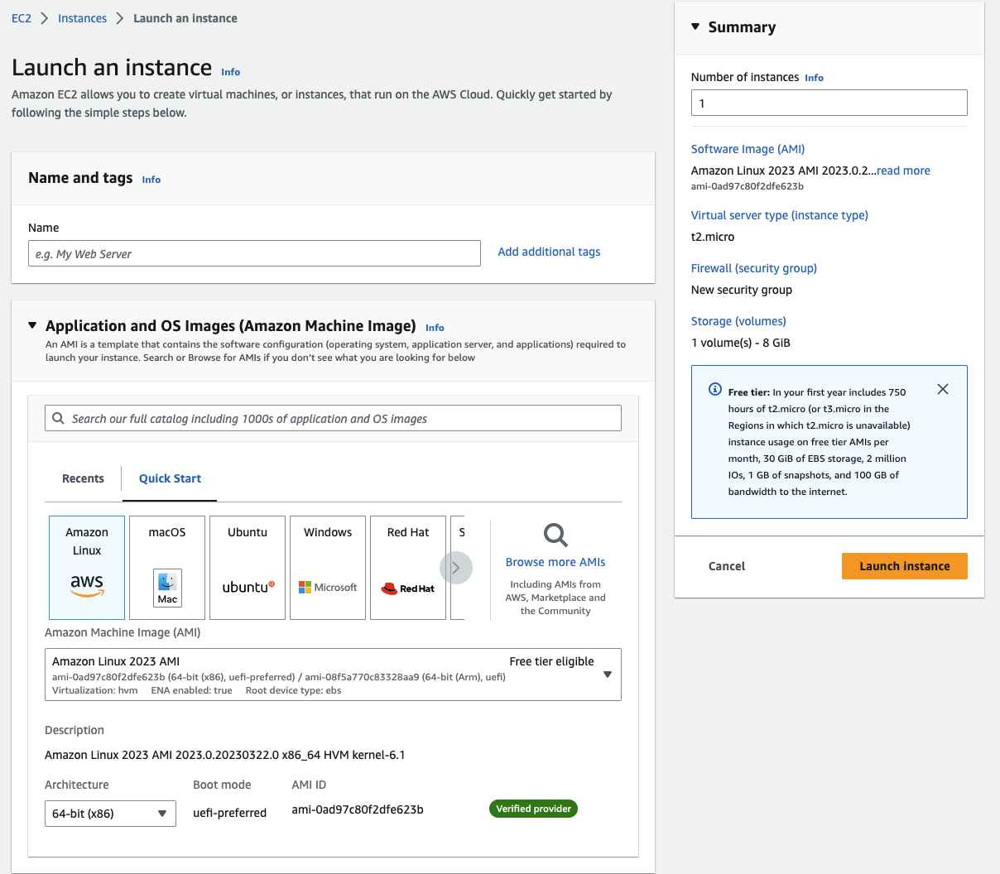
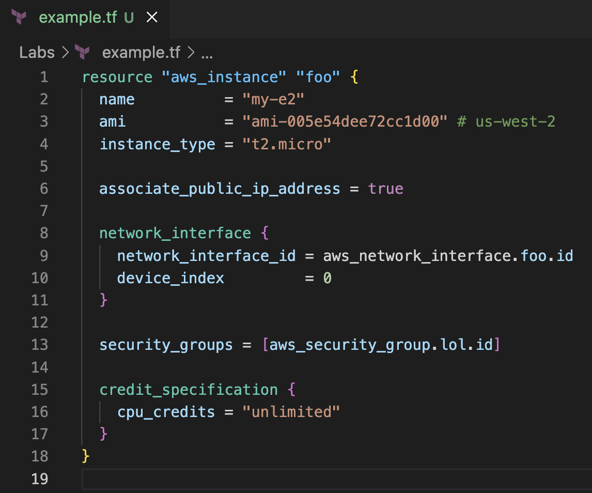
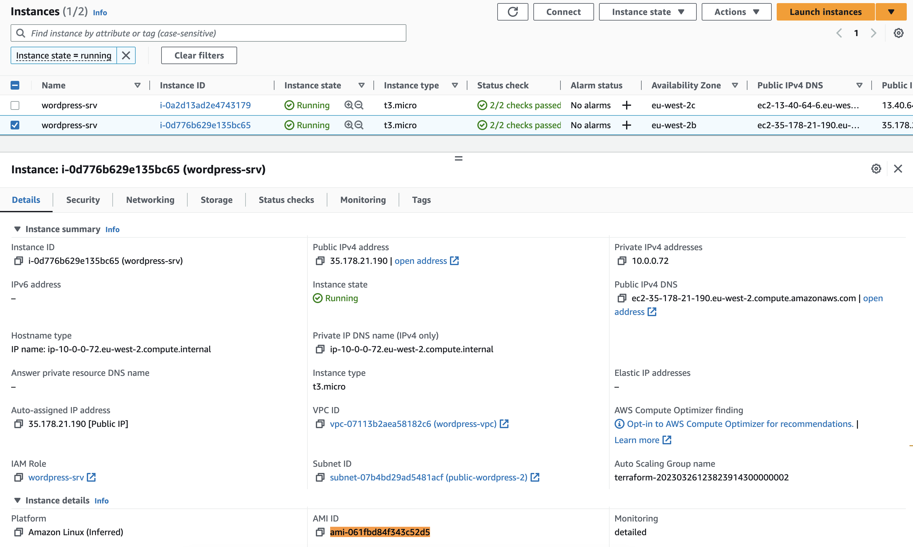
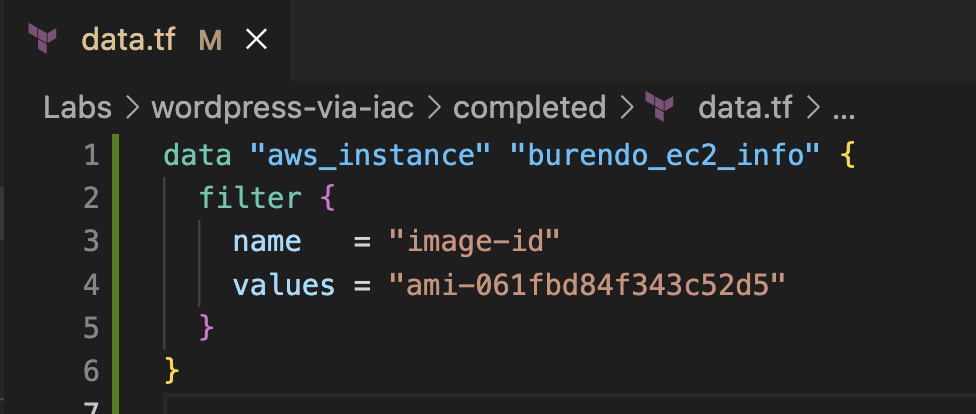
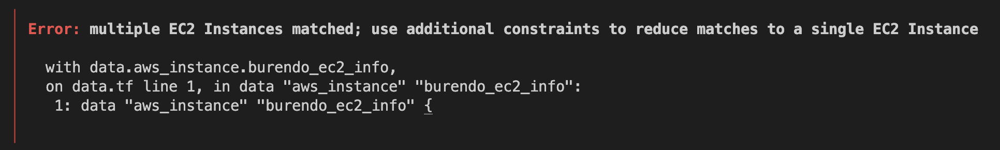
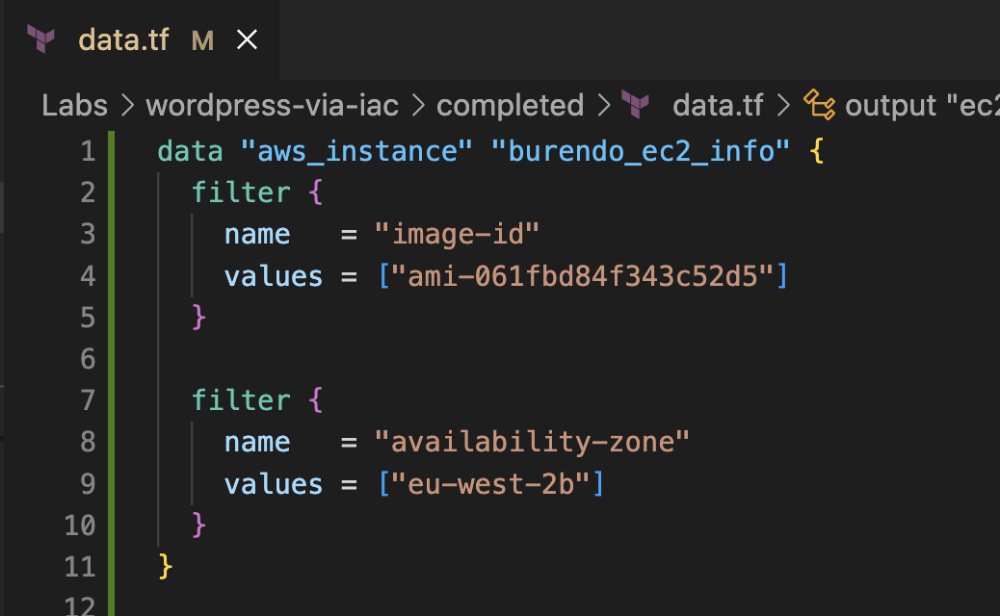
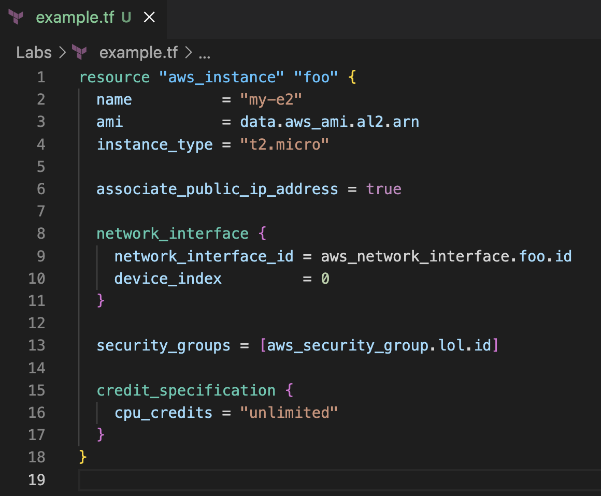
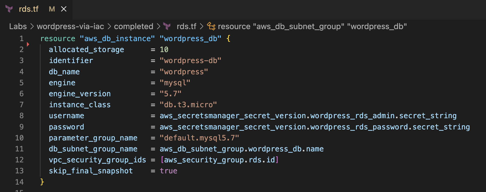
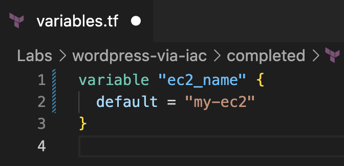

# Terraform Fundamentals
We are going to look at the building blocks of Terraform infrastructure.

Terraform as a tool allows for infrastructure creation across multiple cloud providers. For the purpose of this Lab, we want to use AWS.

Terraform has a 'plugin' style concept that it calls 'providers', in order to create and work with AWS infrastructure in Terraform we must make use of the 'AWS' provider plugin.

There are two key building blocks to understand that apply to all providers; a) Resources and b) Data Sources
Each provider has different names and definitions for the resources and data sources, but the structure of either never changes.

We build Terraform infrastructure by creating resource and data source files for the services we want to use. Terraform files that reside in the same folder / directory are consider a Terraform project.
For this Lab, the `attempt` and `complete` are separate folders and therefore considered separate 'projects' by Terraform.

Once we've built our Terraform infrastructure project, we need to plan and deploy it. This is an important concept that helps you to understand the importance of resources and data sources, so we'll start there first.

# Contents
- [Terraform plan and apply](#plan-and-apply)
- [Resource block](#resource-block)
- [Data Sources](#data-sources)
- [Interlinking](#interlinking)
- [Variables](#variables)
- [Terraform State](#terraform-state)

## Plan and apply
Terraform is a tool which interprets Terraform files, which are written in Hashicorp Configuration Language, to evaluate and create what infrastructure to create in the cloud environment.

Terraform has many commands but most notably is `terraform plan` and `terraform apply`.

The Terraform plan command, uses the terraform files, creates a local representation of what the infrastructure should look like and compares this with the current 'state' of the environment you would deploy to. The differences are now shown to you. See [terraform state](#terraform-state) for a better understanding of what state is.
Planning is not destructive, no actions are taken against the infrastructure in the environment.

The Terraform apply command, uses the terraform files similar to terraform plan however, this time will ask for confirmation on the changes it is about to make and then proceed to make those changes in the environment you are choosing to deploy to. Terraform apply is therefore considered a destructive command. It has the potential to undo work and cause an infrastructure to break intentionally or unintentionally - so be careful!

Terraform apply will use the changes you've accepted and instruct AWS of the resources you want to create / remove.

What is a resource?

## Resource block
Whenever you create any service in AWS, like EC2 or RDS, you are creating an infrastructure resource.
In the AWS console you would create resources using web forms, clicking and entering details. In the industry, we call this ClickOps.

An example of ClickOps - Creating an EC2 instance using the AWS console:



All of the options that are available in the console, are also available when creating a Terraform resource.

Think of a Terraform resource as the web form you complete in the AWS console, but in text or 'code'.

An example of an EC2 resource in Terraform.


In the Terraform you will notice similar information being provided as the AWS console screenshots.
ie. Name, Amazon Machine Image (AMI) ID and Instance type.

>The structure of a Terraform resource definition is:
>```'resource' 'resource type' 'custom name'```
>ie. resource "aws_instance" "foo".

Some values for a resource are mandatory, some are optional and may not be needed for the resource you are creating.

For all Terraform resources, you can refer back to the [Terraform documentation](https://registry.terraform.io/namespaces/hashicorp) to find out information on what attributes are required. Given we are using the AWS provider, we would look at the documentation relevant to that - [Terraform AWS Provider documentation](https://registry.terraform.io/providers/hashicorp/aws/latest/docs).

This in essence, is all that a Terraform resource is.

## Data Sources

Data sources are another fundamental building block of Terraform infrastructure. They allow us to 'read' data from within our AWS environment.
For instance, if we created the EC2 instance given as an example in the [resource block](#resource-block) section, we could use a data source to read data about that EC2 and make it available for use in our Terraform infrastructure.

On the AWS console, we can take a look at the information available to us for an EC2 by finding that particular instance.

> The AMI ID is highlighted on purpose.

In Terraform we can define a data source to 'fetch' that data, so we can make use of it within our Terraform files.

Data sources can make use of filters or unique resource IDs to find the data. 

In this data source, we are wanting to find the information about all EC2 instances that have an AMI ID of `ami-061fbd84f343c52d5`.

>The structure of a Terraform data source definition is:
>```'data' 'data type' 'custom name'```
>ie. data "aws_instance" "burendo_ec2_info"

For the example in use, we are being too broad with our filtering and will encounter an error when we attempt to `terraform apply`.


Data sources must filter to one resource. To fix this issue we can add further filers, to resolve the filtering to a single resource in the data result.



The information we gain from data sources depends on the resource we took data from.
For the EC2 example we've just shown, we now have the IP and instance ID available to us to use in Terraform.

When we say 'use within Terraform', that links us nicely to [Interlinking](#interlinking).

That's it for data source.

## Interlinking
Terraform resources and data sources are nothing but individual configurations. However Terraform is smarter than just being config in a file; it has awareness of all other resource configurations within the project and therefore we can 'interlink' resources or data sources within other resources or data sources.

When we want to use interlinking, we can call on the resource or data source by using it's resource or data source type and unique name like such:
`aws_instance.foo`
(For data sources, prefix with `data.`)

What do we mean by that?
Take this EC2 Terraform resource:


The AMI value in this example is a string. We can use Terraform interlinking to replace this string with a data source, which allows the value to be dynamic. The value from the data source is gained at `apply` time.

If we create a data source, to find the AMI ID dynamically like so:


We can interlink that data source into our EC2 resource like so:

> Notice the replacement of "ami-XXX" to `data.aws_ami.al2.arn`

Interlinking also works for resources and the information they hold.
For example, in an RDS resource, we can interlink an AWS Secret resource for the username and password values for the RDS administrative user.


Interlinking can also be used for variables. For variables, we interlink them using `var.my_variable_name`.

What are variables?

## Variables
Variables in Terraform are just like variables in any other programming language. They hold a variable value but offer a fixed variable name.

For Terraform however, variables can be overridden at `apply` time by using the command like such:

```terraform apply --var="example_var=ami-abc123" --var="fake_var=foo"```

Variables can have a default value which is used if a variable value is not supplied at `apply` time.



## Terraform State
The 'state' is an overview of what resources have been deployed (& managed by Terraform) in an environment.
Terraform uses this state to advise on changes when using `plan` or `apply`.

For this Lab, the state is only available on the computer you are deploying the Terraform from. 
In a team environment, we place the state into a centralised place. This allows multiple team members to work with the same Terraform project at the same time, without causing conflicts and destroying infrastructure that another team member has created - without being made aware that you are doing so.

Gain a deeper understanding of Terraform state by reading the [Terraform state documentation](https://developer.hashicorp.com/terraform/language/state).
