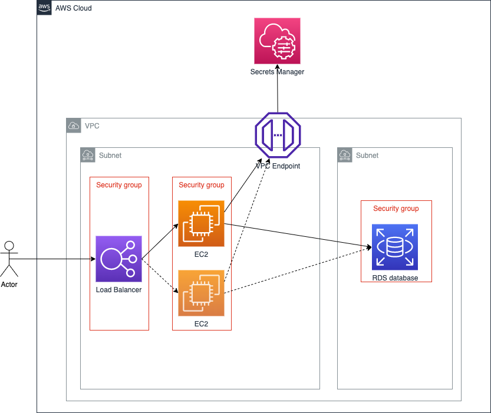

# Building the infrastructure for a WordPress website

This Lab is 1 part knowledge & 1 part action. Before attempting to complete the 'action', consider gaining the knowledge.

# Lights, Camera, ACTION
Within the [attempt](./attempt/) folder you will find a 'broken' Terraform infrastructure set for a WordPress website.
Your task is to take your new found knowledge and understanding of both Infrastructure as Code & Terraform, apply it to the 'broken' files and attempt to complete the infrastructure.

In diagram form, the end result should look something like this:

## Going further
The broken Terraform leaves room for improvement. 
