# WordPress via the AWS Console
In this lab, we will build a WordPress website in the cloud.
This instruction set will use the AWS console exclusively and introduce you to key AWS services such as VPC, EC2, IAM, S3.
We've built this instruction set to operate using AWS free-tier services, read more about AWS free tier.

## Prerequisites

- AWS Account
- A web browser

## Known Issues
- iPads and other tablets aren't usable.

# The Lab
To follow along, you must be signed in to an AWS account with billing set up. Don't fear, as long as you follow the tear down, you'll not cost yourself much.

In this lab we will cover the following services:
- VPC
- VPC Endpoints
- EC2
- RDS
- S3

Tip: Make use of the service search bar, when changing between services, at the top of the console page.

# Building a VPC
For more information on VPC, refer to [service-information/README.md](../service-information/README.md#vpc).

At the core of any service on AWS is the VPC. It is fundamental in order to facilitate network traffic between services.
We want to create a VPC to place our required services to host our WordPress website.

Head to the VPC service page. We are going to create a VPC using the VPC wizard. Click `Create VPC`.

`VPC and more` is the option we'd like. On this page we want to complete some details, anything not mentioned keep as default.

|Option |Value |
|:------|:-----|
|Name               | wordpress  |
|IPv4 CIDR block    | 10.0.0.0/24|
|Number of Availability Zones| 3 |
|Number of Public Subnets    | 3 |
|Number of Private Subnets   | 3 |
|NAT Gateways | None |

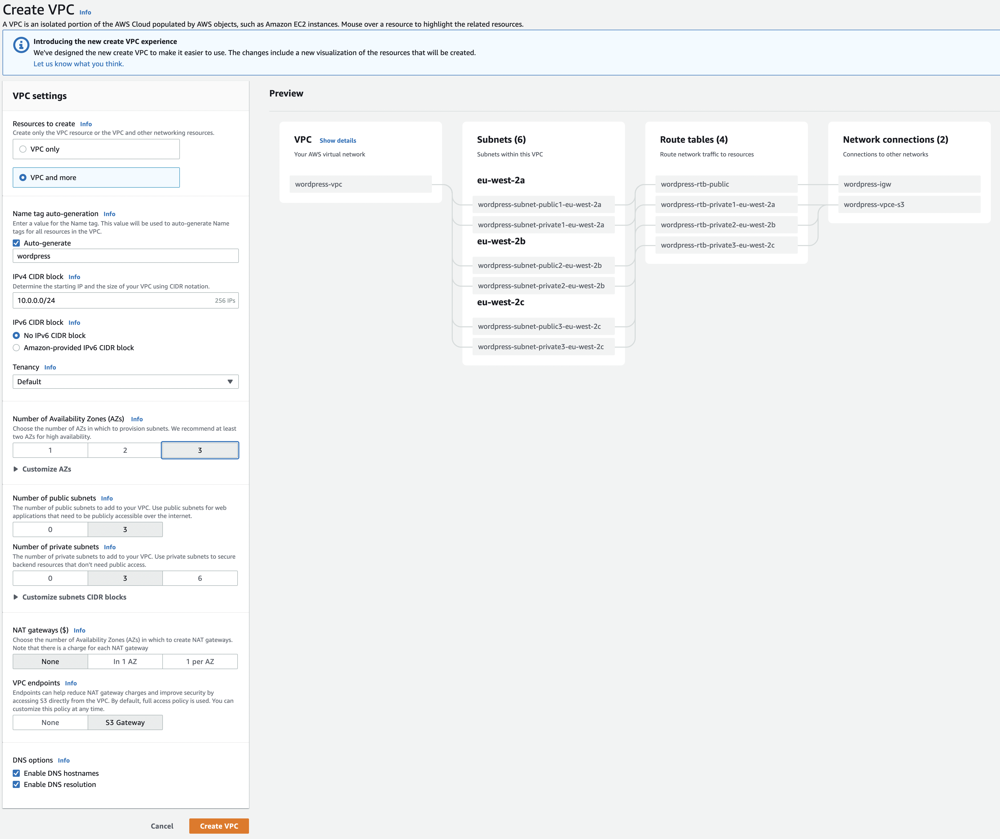

Click create & let AWS do the heavy lifting for you. AWS will create your VPC, subnets and alter route tables to facilitate communication between subnets.

Once the VPC is created, we need to create some VPC endpoints within the newly created VPC.

## Creating and using VPC Endpoints
For more information on VPC Endpoints, refer to [service-information/README.md](../service-information/README.md#vpc-endpoint)

We want to be able to securely connect to our EC2 instance (when we create it in just a moment). We will be using AWS Systems Manager service in order to do this, but before we do, we need to complete the necessary setup for connections to be able to be made.

We will be using VPC endpoints to facilitate this secure connection within the AWS network. Just before we do, we need to create a `Security Group` for the endpoints. For more information on Security Groups, refer to [service-information/README.md](../service-information/README.md#security-group)

### Security Group creation
Within the VPC service page, you will see a `Security Group` option on the left hand side navigation. Head there and then click `Create security group`.

|Option |Value |
|:------|:-----|
|Name               | wordpress-endpoints  |
|Description        | SG for wordpress endpoints |
|VPC                | wordpress-vpc |
|Inbound Rules > Type | HTTPS |
|Inbound Rules > Source | wordpress-srv (Security Group) |

Click create!

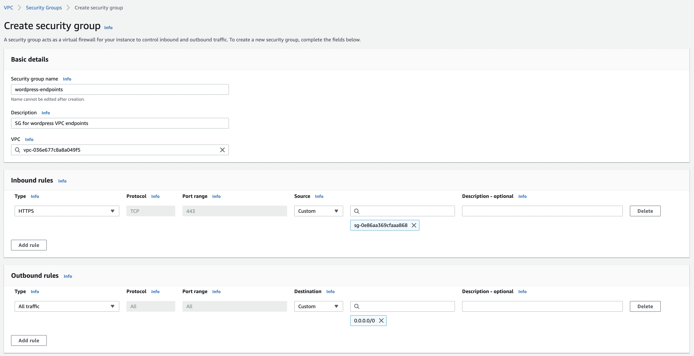

### Endpoint creation
Within the VPC service page, you will see a `Endpoints` option on the left hand side navigation. Head there and then click `Create Endpoint`.

|Option |Value |
|:------|:-----|
|Name   | wordpress-ssm  |
|Service Category | AWS services |
|Services | com.amazonaws.eu-west-2.ssm |
|VPC      | wordpress-vpc |


We want to attach the VPC endpoint to the public subnets - which is where we will be placing our EC2 instance shortly.
Select all three public subnets as follows:
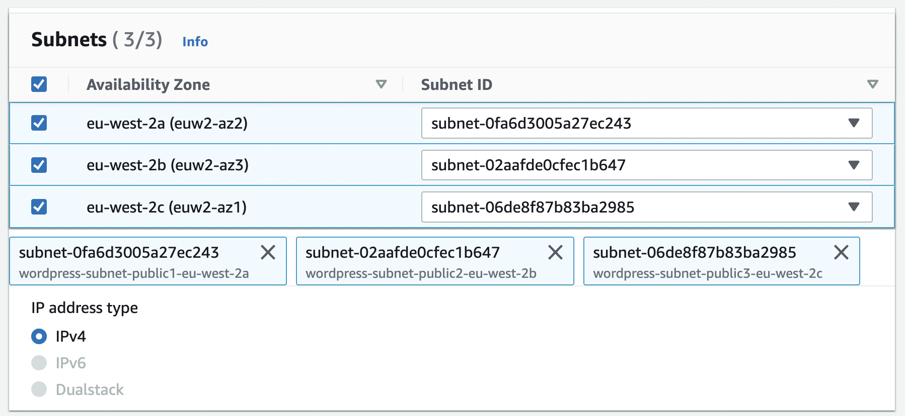

Now we want to attach the  newly created security group 'wordpress-endpoints' to our VPC endpoint.
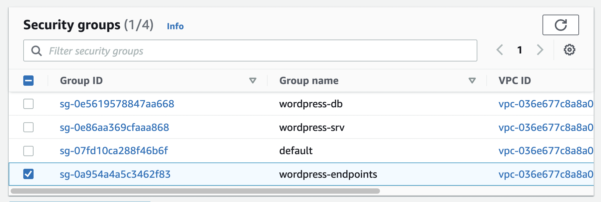

Keeping everything else as default, click create and repeat the actions for the following endpoints:
|Option |Value |
|:------|:-----|
|Endpoint Service | com.amazonaws.eu-west-2.ssmmessages  |
|Endpoint Service | com.amazonaws.eu-west-2.ec2messages  |

That is it for this section.

# Create an IAM profile
For more information on IAM, refer to [service-information/README.md](../service-information/README.md#iam)

Now that we've created our VPC and our endpoints, we need to allow our soon to be created EC2 permission to communicate with the AWS Systems Manager service. Permissions on a service level are handled by the IAM service.

Head to the `IAM` service page, choosing `Roles` on the left hand side navigation, click `Create Role`.

We want to choose AWS as the trusted entity. And our use case is EC2 (this is what we are attaching the IAM too).


On the next page, we want to search for and select the policy `AmazonSSMManagedInstanceCore`. This is a managed policy provided by AWS for the purpose of enabling AWS Systems Manager connectivity.


Finally, we want to name our new role and confirm the policy. We will call it `wordpress-ec2`.


# Create an EC2 instance
For more information on EC2, refer to [service-information/README.md](../service-information/README.md#ec2).

Head to the EC2 service and click `Launch Instance`.
Using the launch instance wizard, we want to configure the instance like such:

|Option |Value |
|:------|:-----|
|Name| wordpress-srv|
|Application and OS Images > AMI Catalog | Amazon Linux |
|Instance Type | t2.micro (Free-tier eligible) |

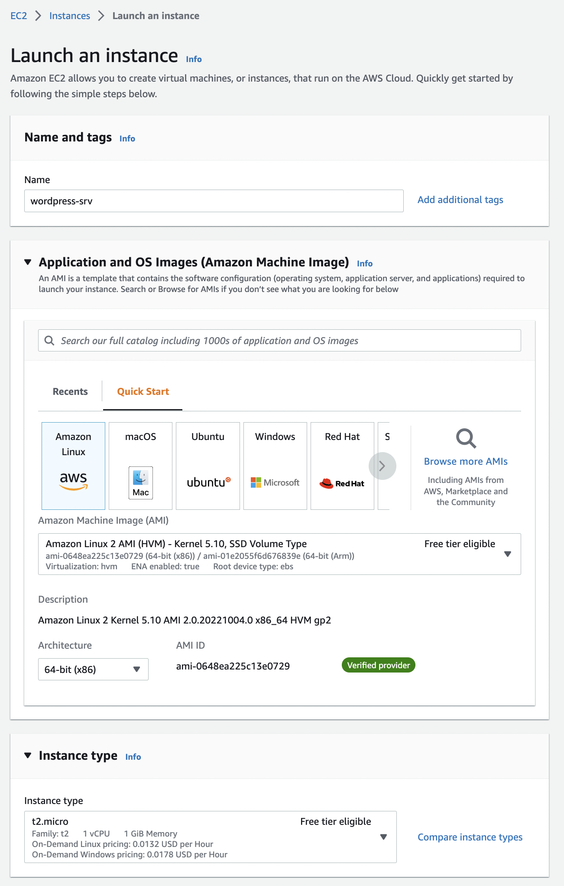

|Option |Value |
|:------|:-----|
|Network Settings > Edit | We want to edit the options |
|Network Settings > VPC | wordpress-vpc |
|Network Settings > Subnet | Choose any with 'public' in the name |
|Network Settings > Auto-assign IP | Enable |
|Network Settings > Firewall | Create new |
|Network Settings > Security Group name | wordpress-srv |
|Network Settings > Security Group description | wordpress-srv |
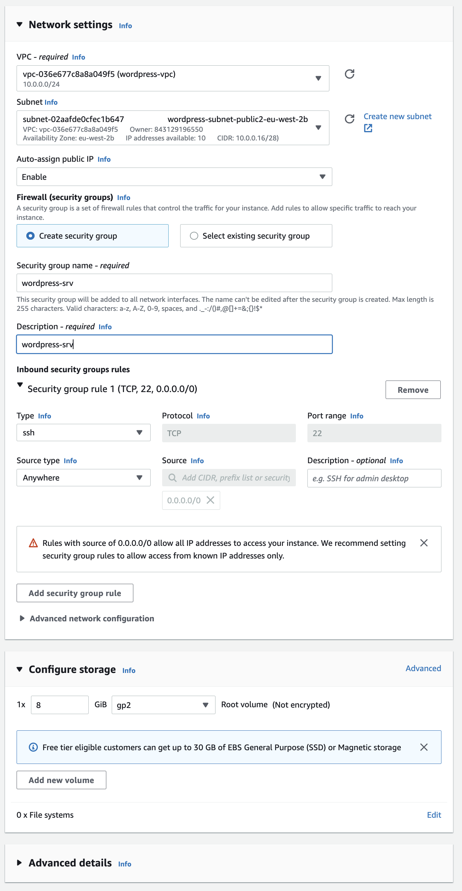

Finally, we want to attach the IAM profile we created in the previous step.
You should be able to select `wordpress-ec2` in the drop down box.


Help: [What is a Security Group?](../service-information/README.md#security-group)

That's it! Click `Launch Instance` on the right hand side.
We'll come back to work on this EC2 shortly.

# Create an RDS database
For more information on RDS, refer to [service-information/README.md](../service-information/README.md#rds).

WordPress requires a MySQL relational database in order to store data about the website content, user accounts and other metadata.
We want to create a MySQL relational database using AWS Relational Database Service.

Head to to the RDS service page. We are going to create an RDS using the RDS creation wizard.
Click `Create RDS`. We want to modify the options listed below, all else keep as default.

We want to choose `Standard Create`, with an engine type of `MySQL`. Under database instance size, we want to choose `free tier`.

|Option |Value |
|:------|:-----|
|Database Creation Method| Standard Create|
|Engine Type  | MySQL |
|Templates    | Free Tier |
|DB instance identifier | wordpress-db |
|Credential Settings > Master username | admin |
|Credential Settings > Master password | auto-generate |
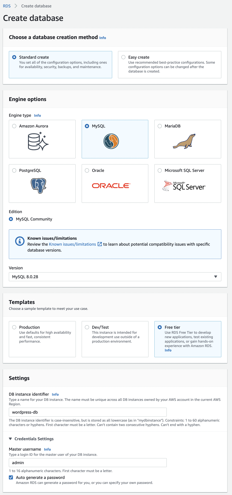

|Option |Value |
|:------|:-----|
|Instance Configuration > DB Instance Class | db.t3.micro |
|Storage > Allocated Size | 50GB |
|Storage > Maximum Storage Threshold | 80GB |
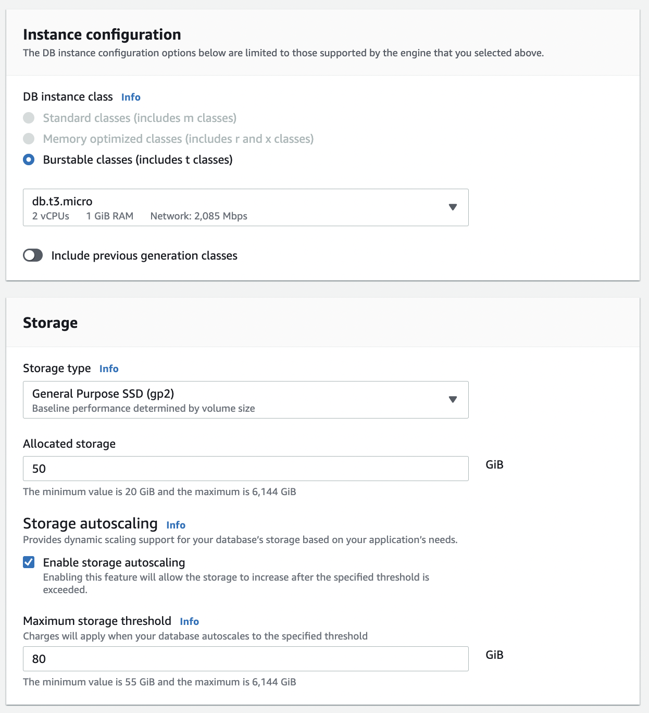

|Option |Value |
|:------|:-----|
|Connectivity | Connect to EC2 Instance |
|Connectivity > EC2 Instance | Select 'wordpress-srv' |
|Connectivity > VPC security group | Create new |
|Connectivity > VPC security group name | wordpress-db |
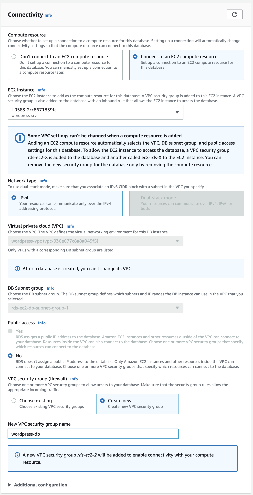

Click `Create Database` - in the background AWS will set up that RDS database, install MySQL database server for us and create default administrative credentials.

We can find out the administrative credentials by clicking `View credential details` in the blue banner at the top of the confirmation screen.
We want to keep a note of this password for later. Save it somewhere!

Additionally, on the RDS service page, we will see our newly created database. If you click into it, you will find some essential details that we need.

Make a note of the endpoint address. If you didn't change the admin username, that will be `admin`. The password you've just gained.
Keep all of these safe!

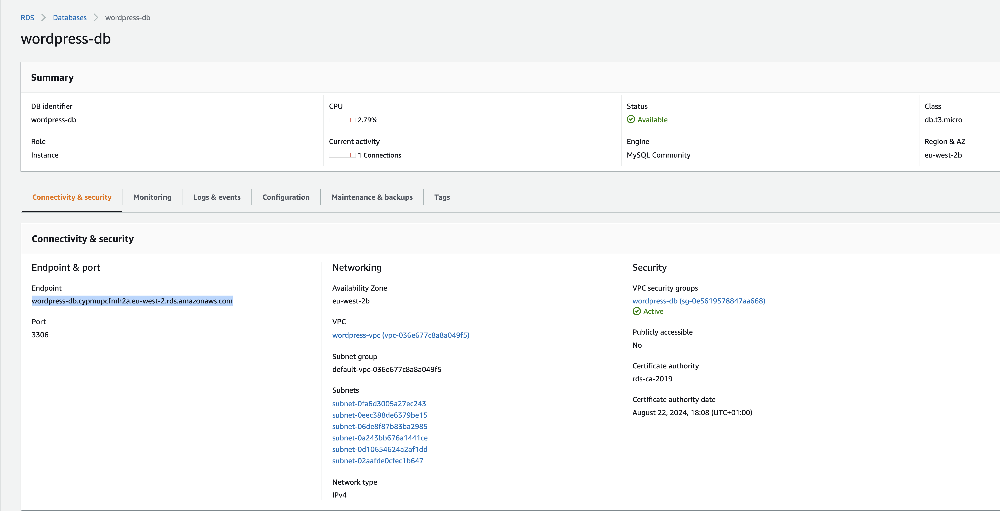

That's it for RDS.

# Modifying Security Groups
So far, we've created three security groups.
One for the VPC endpoints, one for the EC2 instance and just a moment ago, one for the RDS.

We want to enable the EC2 instance to connect to the VPC endpoints. In order to do so, we must modify the EC2 security group `wordpress-srv`.
Head to the VPC service page, on the left hand side navigation panel you'll find `Security Groups`. Find `wordpress-srv` and edit the inbound rules.

You'll notice an inbound rule already exists - port 22, SSH. We want to delete that and instead add the following two rules:

|Option |Value |
|:------|:-----|
|Type|HTTPS|
|Source | wordpress-endpoints |
|Description | Allow inbound from VPC endpoints |


|Option |Value |
|:------|:-----|
|Type|HTTP|
|Source | 0.0.0.0/0 |
|Description | Allow internet traffic |


Next we want to allow the EC2 instance to connect to the RDS Database. We can do this by finding the `wordpress-db` security group and edit the inbound rules there too. You can delete any existing inbound rules.

|Option |Value |
|:------|:-----|
|Type|MySQL|
|Source | wordpress-srv |
|Description | Allow inbound from EC2 |


That's it here.

# Connecting to the EC2
Now that we've created our VPC, EC2 and RDS. We want to begin using them.

Head to the EC2 service page, select the instance we want to install WordPress on - called `wordpress-srv`.
Once selected, we can click `Connect`.


We've already done the necessary setup for AWS Systems Manager, which will now allow us to connect to the instance within the browser.
Choose `Session Manager` and click `Connect`.

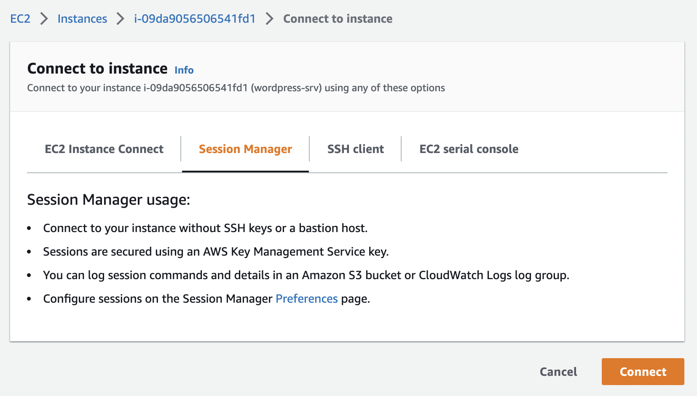

You'll be greeted by a black screen, this is a SSH prompt. For more information SSH, refer to [SSH.com What is SSH?](https://www.ssh.com/academy/ssh)


Within SSH, we are instructing the remote computer using commands. The remote computer in our case runs Linux, so we must use Linux commands.
We can run the following commands in order:

```sudo su```

```cd /tmp```

The following command will download and execute an automated setup script. You will see a lot of commands being actioned.
Don't panic! It is normal.

```wget -O - https://raw.githubusercontent.com/BurendoUK/burendo-aws-labs/wordpress-via-console/ec2-wordpress-install.sh | bash```

Now that we've downloaded and installed the necessary service applications and the WordPress source code, we can setup a database schema to round off everything we need to do here.

Running the following command will give you prompts to enter the RDS details you've taken a note of. Be sure to enter them within any spacing!
```wget -O - https://raw.githubusercontent.com/BurendoUK/burendo-aws-labs/wordpress-via-console/ec2-database-setup.sh | bash```

We've done all we need to do here. You can close the Systems Manager window safely by closing `Terminate` on the top right.

# Connect to the website
Now we've done everything we needed to, to allow us to configure WordPress. We can now grab the Public IP address for the EC2 instance `wordpress-srv`, open a new tab and go there.

All being well, you will be presented with the WordPress configuration screen.
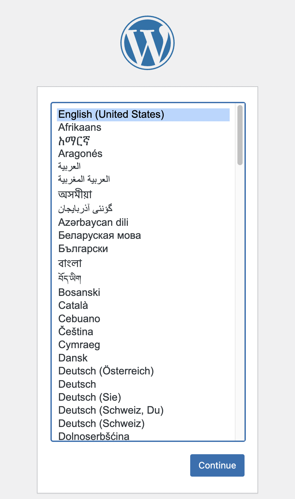

The next page will ask us for the database details once again - don't worry, you've made a note of these.
|Option |Value |
|:------|:-----|
|Database name|wordpress|
|Username | admin |
|Password | Your saved password |
|Database host | Your saved hostname |
|Table prefix  | wp_ |
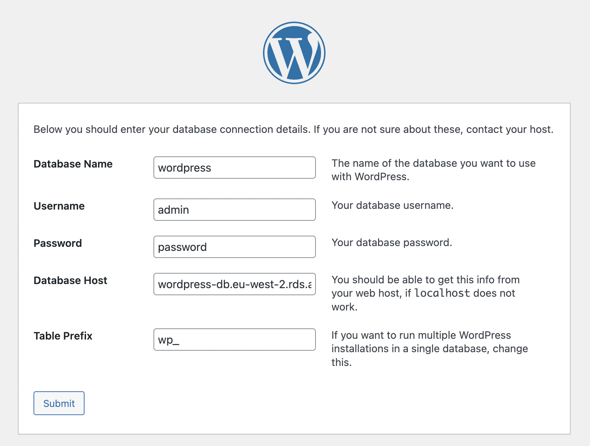

Click next, then `Run the installation`. Next you'll be given options that relate to your website.
The username and password here, is for your administrator user for the website - not for the database!

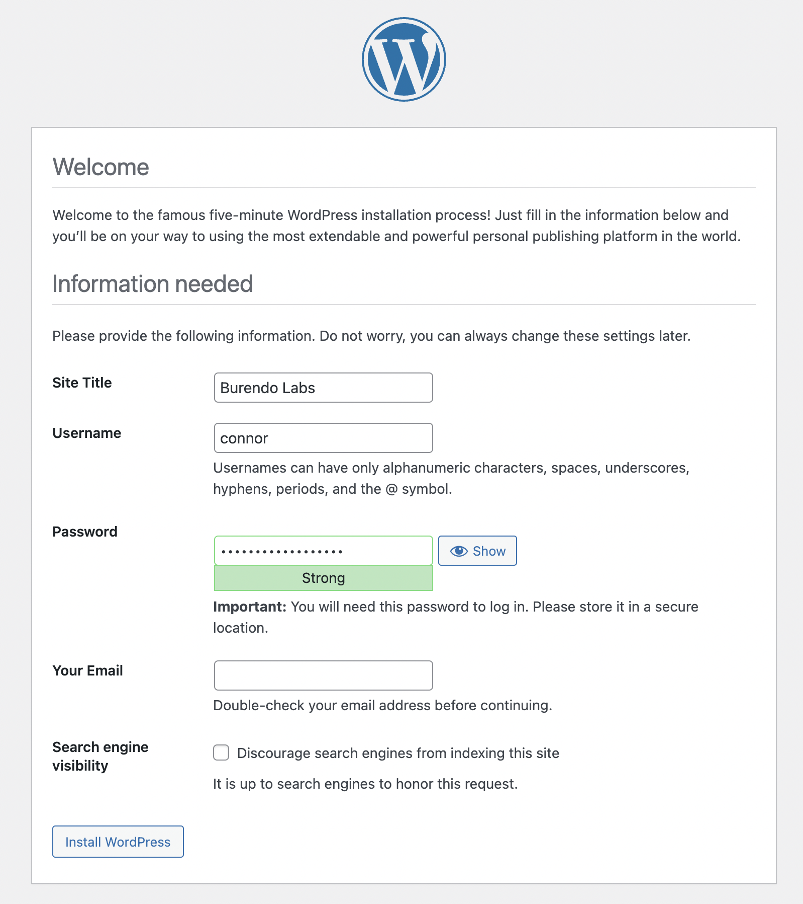

Click Install and wahoo! You've created a WordPress website!


# Tear down
When you are ready to tear down your WordPress website - follow these instructions:

Head to the EC2 service page, find your instance `wordpress-srv` and terminate it.
Head to the RDS service page, find your RDS database `wordpress-db` and terminate it - not keeping backups.
Once your RDS has been terminated, head to the VPC service page.
On the left hand side navigation, find endpoints and delete the three endpoints you created.
Once they've terminated, you can attempt to remove the VPC `wordpress` - you may hit an error that it isn't able to terminate at this moment. You will need to wait an hour or so before trying again.
The issue here is likely to be that the elastic network interfaces (ENI) that the VPC endpoints created, haven't yet terminated.
